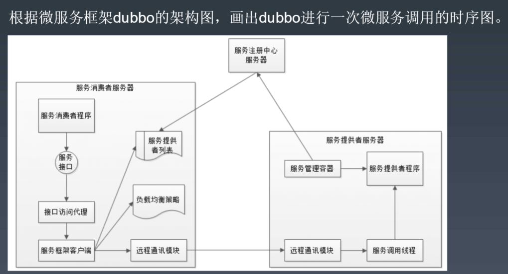
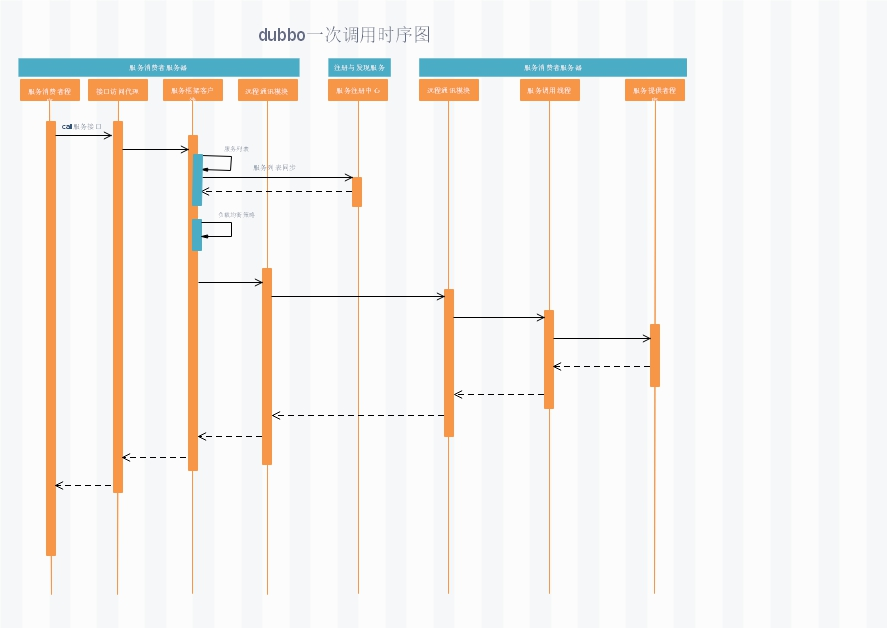

# 

####题1：dubbo一次调用时序图

解：1、服务消费程序(client) 根据协议调用暴露提供的接口
    2、通过接口访问代理委托给服务框架客户端
    3、服务框架客户端通过服务提供者列表容器获取到 服务提供者所注册的服务基本信息(比如：地址、端口、服务等)，触发负载均衡策略，最终获取得到最合适的服务信息
    4、通过远程通讯模块与服务提供方对应的远程通信模块进行通信
    5、服务提供方把接收到的请求信息转交给服务调用线程进行对应的服务调用处理
    6、返回服务提供者程序计算后的响应报文结果信息

####题2：关于微服务架构(中台架构、领域驱动设计、组件设计原则)，你有什么样的思考和认识？
理论就不写了，网上已经说得云里雾里的，各种书层出不穷，说说自己的看法吧，欢迎老师指正。
微服务架构原本是被人诟病的传统SOA架构演变而来
SOA最令人头疼的就是ESB，中心化严重，也最为成瓶颈，另外服务治理上也是一大问题，所有的服务协议及组件都堆在上面，随着业务爆发，也是成为个大胖子，对，300公斤的大胖子，不容易挪动，
SOA在2010年前后还是算比较火的架构，但由于互联网的爆发式增长，以上瓶颈凸显出来，笨重，乱，难治理，耦合严重。
前后很多互联网公司就开始拆解，把所有组件拆解出来，成为拔插式、独立自主性的，减轻和优化中心服务的问题和压力，比如：服务用不上消息队列，我就可以选择不用，需要用的时候在拔插上去，
演变一番后，连服务都可能不在一个注册中心，而是多个注册中心，或者不同程序提供者服务的管理服务可能在不同的服务集群上面，直接推动了，服务的微小机动化演变
所以广义上来讲，微服务也算是一种SOA的特殊化或者实现方式
可以说是技术架构上的演变

然而中台架构更多的是应用场景的演变，打个比方，以前只有老板和你，你们像兄弟一样，随着公司壮大，后面又来了几十位兄弟，然后分为了十几条线，你们都跟老板每天称兄道弟的，有天需要搞个新业务了
需要快速上线，但是呢，新业务需要用到你们几条线的资源，但是对你们几条先的回报很少，都不愿意，但是都可以提供服务，老板也犯难，每次都犯难，老板又不能说就这样吧，过一天算一天；
于是SOA都拆得，你们就拆不得，拆，把类似的业务场景拆出来，不拆的不接的，老板就不给资源，你们自生自灭吧，于是就跟拆庞大软件一样，多了一层分赃的....
说到这里，应该知道中台也不是什么高大上的架构，而是场景演化来，主要做业务解耦，服务资源集中化治理，是场景复杂度到了一定高度，而不是中小公司小小炒作的，也许你连业务都没有或者一点点，哪里来的耦合？

再来说说领域驱动设计，这东西好歹也有十几二十年了吧，为啥现在才火呢，其实还是回归到复杂性上面来看，软件的维护成本是和复杂性成正比的，而回到10年以前，代码的复杂性都还可以完全用if else搞定
也就用不到 按领域来划分业务进行设计，或者不适用，软件设计的原则，永远都是简单和合适，因为一旦涉及引入新的设计是需要巨大的学习成本和人力成本，还需要制定更多的规范去执行最初的设计理念，
但是今天来讲，每行每业的软件互联的应用场景的复杂度，都已是过去十年的好几个指数，需要有更合适的设计要支撑软件灵活和多变；
以前是怎么快怎么来，现在呢，回过头来一看，还是各领域划分界定清楚了好，这好比是以前面向对象是封装了class，来减少class与class之间的感知，现在封装class已经顶不住复杂性，那范围扩大，封装子域组装构建成一个个的领域模型，屏蔽实现，减少外界感知
....

组件设计，也是差不多套路，只是实现方式不同罢了，组件设计偏向于把通用的东西组件化，达到复用...

纯属个人观点，有偏差麻烦指出，以便更正，有时间再补充...

