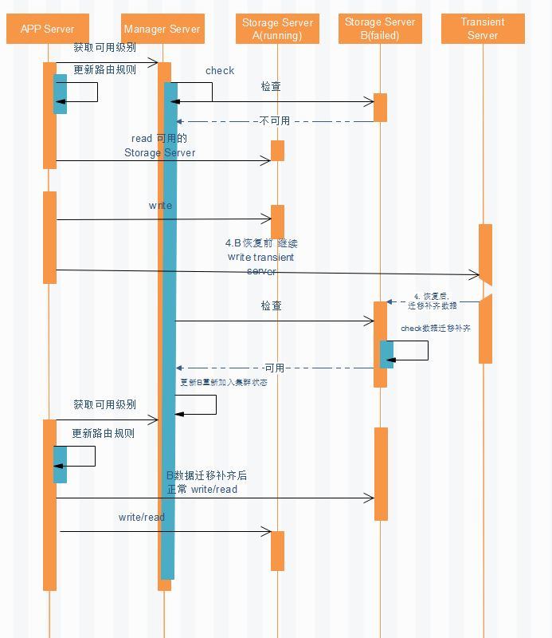

# Doris 失效状态恢复过程

####题1：Doris 失效状态恢复过程？
主要由集群协调者Manager Server维护 Storage Server 的可用状态，Storage Server负责上报状态，
如有不可用，应用服务能通过管理服务感知到，并更新自己的路由规则，读可用，写可用和临时Server
当fail Server重启后，能在 临时Server 把缺失数据补齐，达到可用状态后，上报到 Manager Server 更新装态，
最后广播或者下发通知到各 APP Server,恢复正常读写。

